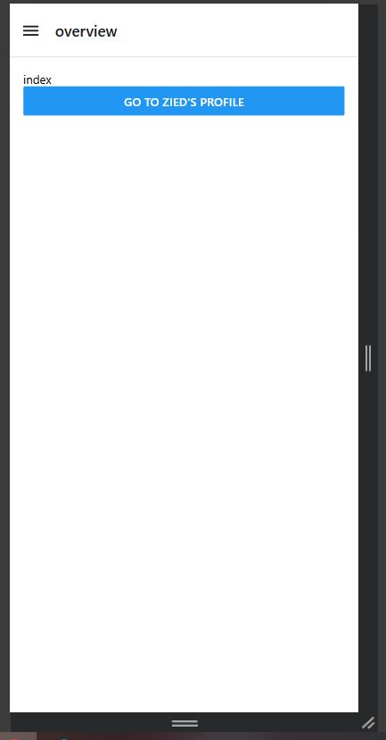
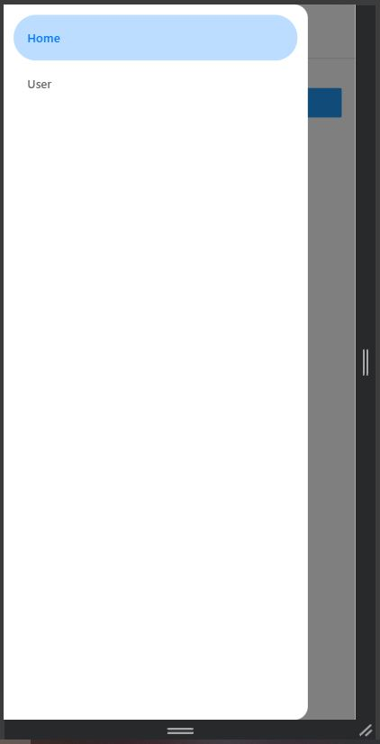
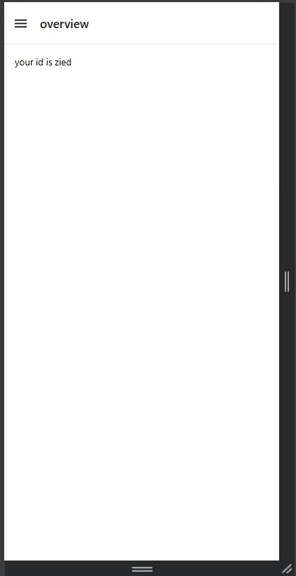

# Drawer

- **Learn how to use the Drawer layout in Expo Router.**
```sh
$ npx create-expo-app drawerNavigator --template blank 
$ npx expo install expo-router react-native-safe-area-context react-native-screens expo-linking expo-constants expo-status-bar
$ npx expo install @react-navigation/drawer react-native-gesture-handler react-native-reanimated
```

## Screenshots





